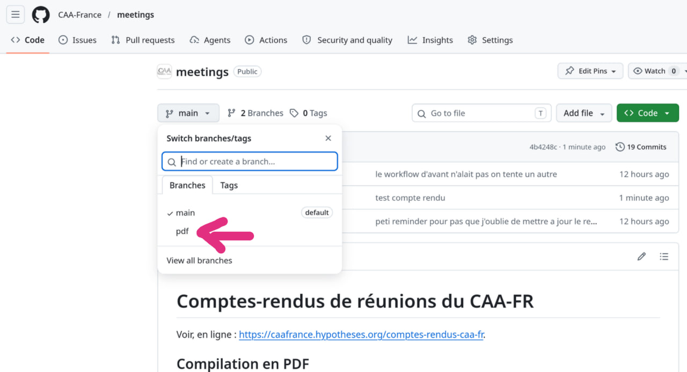

# Comptes-rendus de réunions du CAA-FR

Voir, en ligne : <https://caafrance.hypotheses.org/comptes-rendus-caa-fr>.

## Compilation en PDF

Installer pandoc : <https://pandoc.org/>.

Nommer le fichier Markdown selon le modèle : `CAA-FR_compte-rendu_AAAAMMJJ.md` (remplacer `AAAAMMJJ` par la date de la réunion).

Ajouter l'entête suivant au fichier Markdown (penser à changer la date) : 

``` yml
---
author: https://caafrance.hypotheses.org
date: AAAA-MM-JJ
lang: fr
mainfont: 'Linux Libertine O'
secnumdepth: 2
title: CAA-FR. Compte-rendu de la réunion des membres CAA, JJ MM AAAA
toc: "yes"
toc-depth: 2
toccolor: teal
urlcolor: teal
---
```

Il peut être nécessaire d'installer au préalable la font Linux Libertine sur votre machine : <https://libertine-fonts.org/>.

Compiler au format PDF :

``` bash
pandoc CAA-FR_compte-rendu_AAAAMMJJ.md --pdf-engine=xelatex -o CAA-FR_compte-rendu_AAAAMMJJ.pdf
```

## Compilation des comptes rendu via github actions:

Pour compiler un compte rendu, ajoutez le dans le dossier `compte-rendus/` en suivant le format décrit dans la section précédente:

```bash
git add compte-rendus/CAA-FR_compte-rendu_20260417.md
git commit -m "Compte rendu du 17 Avril 2026"
git push
```

Un fois fait, le workflow va compiler le markdown et le mettre dans la branch "pdf". Le pdf sera disponible une fois que la checkmark verte appairaît. Il vous faudra ensuite cliquer sur la liste des branches et sélectionner "pdf" pour pouvoir télécharger le pdf final.


